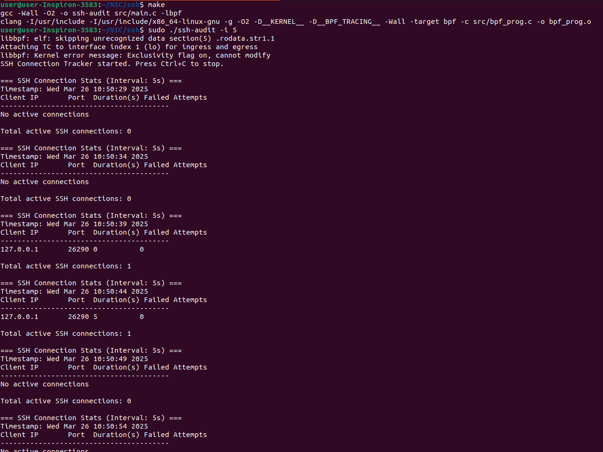

# ssh-audit

This implements SSH connection tracking tool using eBPF and the Linux Traffic Control (TC) subsystem. It monitors SSH connections, tracking active connections by client IP and source port.

/src/bpf_prog.c:
- Attached to both ingress and egress TC hooks on the lo interface.
- Detects new SSH connections (TCP SYN packets to port 22) and adds them to a BPF hash map (connection_map).
- Removes entries when a connection ends (TCP FIN or RST packets).
- Logs events via bpf_printk (can be seen in /sys/kernel/debug/tracing/trace_pipe).

/src/main.c:
- Periodically reads the connection_map and prints active SSH connections, including client IP, port, duration.

Note : Change interface name in line 145 of main.c, I kept it **lo** (loopback) to test with ssh to localhost

---------

## Features
- Tracks SSH connections in real-time on the loopback interface.
- Automatically removes connections from the map when they terminate.

## Limitations
- If system reuses a source port immediately after closing an SSH session, a new entry might appear in the map before the user-space program updates its output.

---------

## Steps to run

**1. Clone this repo and Navigate to directory**
      
**2. Compile the project**
   ```
   make
   ``` 

**3. Clean up existing TC hooks**
   ```
   sudo tc qdisc del dev lo clsact
   ``` 
   
**4. Run executable**
   ```
   sudo ./ssh-audit -i 5
   ``` 
	This logs details every 5 seconds
	
**5. To test : Start SSH session**
   ```
   ssh <username>@localhost
   ``` 
	Entry can be seen in ssh-audit terminal
   	
**6.  To test : Stop SSH session in ssh terminal**
   ```
   exit
   ``` 
	We can be seen entry removed in ssh-audit terminal
	


